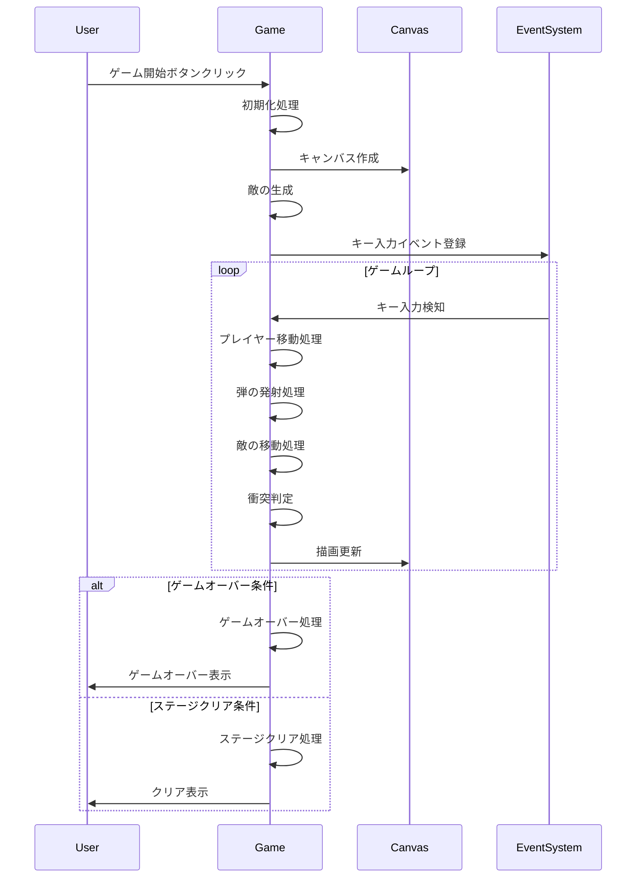

# スペースインベーダー風ゲーム 技術仕様書

## 技術スタック

### フロントエンド
- HTML5
- CSS3
- JavaScript (ES6+)
- Canvas API

### 開発環境
- モダンブラウザ（Chrome, Firefox, Safari, Edge等）
- ローカル開発サーバー不要（静的ファイルのみ）

## 環境構築方法

1. リポジトリのクローン
```bash
git clone https://github.com/blackdesigntokyo/interactive-web-demos.git
cd interactive-web-demos/invader_game
```

2. ローカルサーバーでの実行（任意）
```bash
# Pythonの場合
python -m http.server 8000

# Node.jsの場合
npx serve
```

3. ブラウザでアクセス
- ローカルサーバー使用時: `http://localhost:8000/invader.html`
- 直接ファイルを開く場合: `invader.html`をブラウザで開く

## シーケンス図



## 核となる機能のコード

### 1. ゲームの初期化とメインループ

```javascript
class Game {
    constructor() {
        this.canvas = document.getElementById('gameCanvas');
        this.ctx = this.canvas.getContext('2d');
        this.canvas.width = 800;
        this.canvas.height = 600;
        
        // プレイヤーの初期化
        this.player = {
            x: this.canvas.width / 2,
            y: this.canvas.height - 50,
            width: 40,
            height: 30,
            speed: 5
        };
        
        // ゲーム状態の初期化
        this.bullets = [];
        this.enemyBullets = [];
        this.enemies = [];
        this.shields = [];
        this.score = 0;
        this.lives = 3;
        
        // イベントリスナーの設定
        this.setupEventListeners();
    }

    gameLoop() {
        this.update();
        this.draw();
        if (!this.gameOver) {
            requestAnimationFrame(() => this.gameLoop());
        }
    }
}
```

### 2. 衝突判定システム

```javascript
checkCollision(rect1, rect2) {
    return rect1.x < rect2.x + rect2.width &&
           rect1.x + rect1.width > rect2.x &&
           rect1.y < rect2.y + rect2.height &&
           rect1.y + rect1.height > rect2.y;
}
```

### 3. 敵の生成と移動システム

```javascript
createEnemies() {
    const rows = 5;
    const cols = 11;
    const startX = 50;
    const startY = 50;
    const spacing = 40;

    for (let row = 0; row < rows; row++) {
        for (let col = 0; col < cols; col++) {
            this.enemies.push({
                x: startX + col * spacing,
                y: startY + row * spacing,
                width: 30,
                height: 30,
                points: (rows - row) * 10
            });
        }
    }
}

moveEnemies() {
    let shouldChangeDirection = false;
    
    this.enemies.forEach(enemy => {
        enemy.x += this.enemySpeed * this.enemyDirection;
        if (enemy.x <= 0 || enemy.x + enemy.width >= this.canvas.width) {
            shouldChangeDirection = true;
        }
    });
    
    if (shouldChangeDirection) {
        this.enemyDirection *= -1;
        this.enemies.forEach(enemy => {
            enemy.y += 20;
        });
    }
}
```

### 4. シールド（防御壁）システム

```javascript
createShields() {
    const shieldPositions = [200, 400, 600];
    shieldPositions.forEach(x => {
        for (let i = 0; i < 3; i++) {
            for (let j = 0; j < 4; j++) {
                this.shields.push({
                    x: x + j * 10,
                    y: this.canvas.height - 150 + i * 10,
                    width: 8,
                    height: 8,
                    health: 3
                });
            }
        }
    });
}
```

## 主要な機能一覧

1. プレイヤー制御
   - 左右移動
   - 弾の発射
   - 衝突判定

2. 敵の制御
   - パターン移動
   - 弾の発射
   - 衝突判定

3. シールドシステム
   - 防御壁の配置
   - 耐久値管理
   - 破壊アニメーション

4. スコアシステム
   - スコア加算
   - ハイスコア表示
   - 残機管理

5. ゲーム状態管理
   - ゲームオーバー
   - ステージクリア
   - リスタート機能 